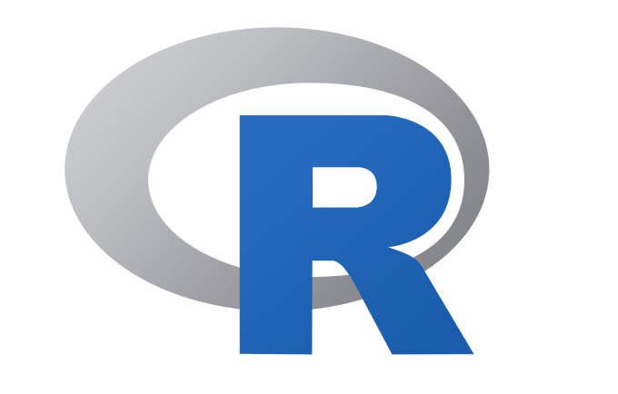
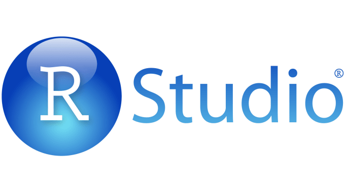

### Get R

**R** is the "engine" we use for data analytics.
It can be run stand-alone and even comes with a rudimentary editor.

<https://cran.r-project.org/>
    

### Get RStudio

**RStudio** is a brilliant *editor* for R. Has tools for writing scripts, viewing plots, making packages, 
and supports several programming languages that an R developer might also use.

[Download RStudio](https://www.rstudio.com/products/rstudio/download/#download)
    

***

### Where can I ask for help?

Go to [Stackoverflow](https://stackoverflow.com/). 

If you want to ask **good questions**, read [minimal reproducible examples in R](https://stackoverflow.com/questions/5963269/how-to-make-a-great-r-reproducible-example/5963610#5963610).

### Other resources

* Similar useR group, for Edinburgh: <http://edinbr.org/>
* Rhus meetup: <https://www.meetup.com/Rhus-useR-group/>
* Teacups, giraffes, & statistics: <https://tinystats.github.io/teacups-giraffes-and-statistics/>


Max
http://cas.au.dk/en/cedhar/events/show/artikel/intermediate-r-data-wrangling-and-visualisation-in-tidyverse/
http://cas.au.dk/en/cedhar/events/show/artikel/introduction-to-r-1/

Adéla Sobotkova
http://cas.au.dk/en/cedhar/events/show/artikel/fundamental-data-skills-2-day-workshop/


